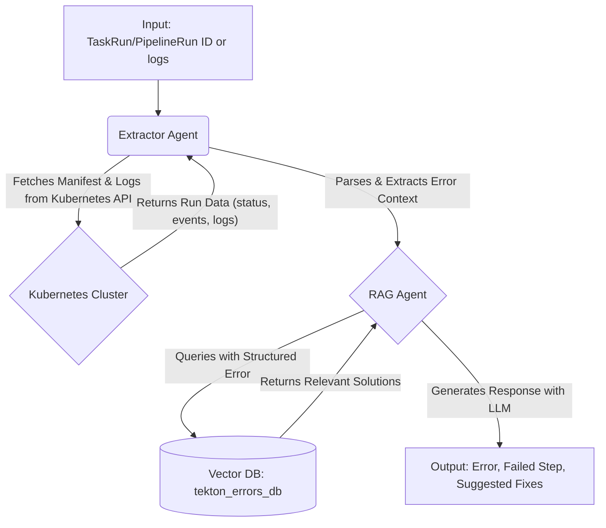

# Tekton Assistant

Tekton Assistant helps explain failed Pipelines/TaskRuns and guide remediation. 

## Tekton Assistant Overview

- **Pipeline Failure Analysis (Explain my failed pipeline)**
  - Retrieves and analyzes logs, status, and events for a failed PipelineRun/TaskRun
  - Identifies the failed step and extracts relevant error messages
  - Produces a concise summary (e.g., "Step 'build' failed due to missing dependency X")
  - Suggests actionable fixes (e.g., permissions, image pull errors)
  - Examples: "Check if secret 'docker-creds' exists in namespace Y", "Verify registry authentication"

## Architecture

### Simplified flow from TaskRun/PipelineRun failure to LLM response


### Two-phase pipeline
```mermaid
graph LR
    subgraph A [Knowledge Ingestion Pipeline]
        direction LR
        A1[Source Data<br/>Docs, GitHub, Curated KB] --> A2[Ingestion (this repo)<br/>Parser/Formatter] --> A3[Vector DB<br/>tekton_knowledge_base]
    end

    subgraph B [Debugging Runtime Pipeline]
        direction TB
        B1[TaskRun/PipelineRun ID or logs] --> B2[Context Extractor] --> B3[Query Builder] --> B4[RAG Agent]
        A3 -.-> B4
        B4 --> B5[Response Generator]
    end
```

---

## Ingester (Go CLI)
This component prepares and indexes the knowledge base used by the runtime RAG agent.

### Prerequisites
- Go 1.22+
- A running LlamaStack endpoint (Ollama or Gemini distribution)
- Knowledge base JSON at `data/curated/kb.json` (same schema as the Python ingester)

Example to start LlamaStack with Gemini:
```
docker run -it --rm \
  -v ./hack/gemini.yaml:/app/gemini.yaml:z \
  -v ${SQLITE_STORE_DIR:-~/.llama/distributions/gemini}:/data \
  -e GEMINI_API_KEY=$GEMINI_API_KEY \
  -e SQLITE_STORE_DIR=/data \
  -p 8321:8321 \
  docker.io/llamastack/distribution-starter \
  --config /app/gemini.yaml
```

### Build
```
go build ./cmd/ingester
```

### Usage
```
./ingester --help

# Ingest curated knowledge base (defaults kb path to data/curated/kb.json)
./ingester ingest \
  --endpoint http://localhost:8321 \
  --vector-db tekton_errors_db \
  --embedding-model text-embedding-004 \
  --embedding-dim 384 \
  --chunk-size 512 \
  --batch-size 50

# Search examples (pretty output by default)
./ingester search --query "create-trusted-artifact" --max-results 5
./ingester search --query "kustomization.yaml" --max-results 5

# Stats / Validate / Reset
./ingester stats
./ingester validate
./ingester reset --force

# Raw JSON output
./ingester search --query "create-trusted-artifact" --max-results 5 --json-output
```

Flags mirror the Python version where possible. The KB path resolver also checks `data/kb.json` and `../data/kb.json` if needed.

### Implementation notes (Ingester)
- Uses typed SDK services:
  - Vector DB lifecycle: `client.VectorDBs.Register/List/Unregister` (routes under `v1/vector-dbs`)
  - RAG indexing/query: `client.ToolRuntime.RagTool.Insert/Query` (routes under `v1/tool-runtime/rag-tool`)
- Documents are sent as `[]DocumentParam` with `content` set to the Python-style `combined_text` and metadata mirrored (`error_type`, `severity`, etc.).

### SDK
Powered by the official Go SDK. See: [llama-stack-client-go](https://github.com/llamastack/llama-stack-client-go)
